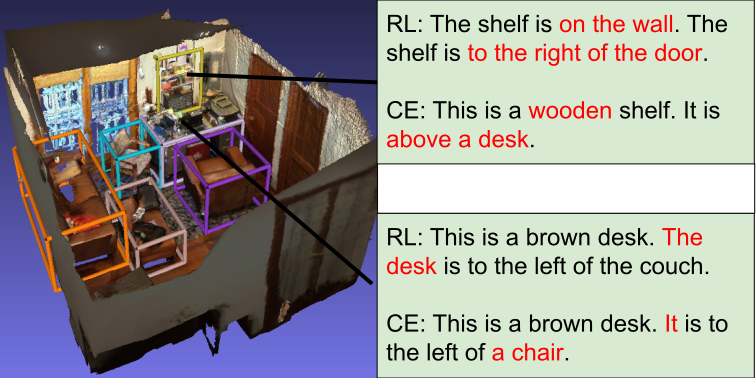

# Dense Captioning on 3D Scenes with Sparse Convolutions and Reinforcement Learning



Code Submission to **Dense Captioning on 3D Scenes with Sparse Convolutions and Reinforcement Learning** [\[pdf\]](docs/Final_Report_3dDenseCap.pdf) [\[poster\]](docs/Poster_3dDenseCap.pdf)

**Authors:** Daniel-Jordi Regenbrecht, Yifeng Dong (equal contribution)

## Data

- Place the scans/ folder from ScanNet in data/scannet
- Run the preprocessing script `data/batch_load_scannet_data.py`
- Place the `scanrefer/` dataset into `data/`
- Place Scan2CAD data in `/data/Scan2CAD_dataset`
- If `scanrefer/ScanRefer_filtered_organized.json` does not exist, run `python scripts/organize_scanrefer.py` to generate it
- For SPICE, first download the contents of https://github.com/tylin/coco-caption/tree/master/pycocoevalcap/spice and put them under 'lib/capeval/spice', then follow the instructions under https://github.com/tylin/coco-caption to download the Stanford CORENLP models and place `stanford-corenlp-3.6.0.jar` and 
`stanford-corenlp-3.6.0-models.jar` into `lib/capeval/spice/lib`
- For METEOR, download the data files from https://github.com/cmu-mtlab/meteor/tree/master/data and put them under 'lib/capeval/meteor/data'

## Installation

### Virtual Environment
(1) Create your Virtual Environment

    conda create -n 3dDenseCap
    conda activate 3dDenseCap

(2) Install prerequisites

    pip install -r requirements.txt
    conda install google-sparsehash -c bioconda

You will also need the cudatoolkit-dev package available at the conda-forge channel, as the cudatoolkit from the pytorch channel does not include nvcc which is needed to compile the custom CUDA extension.

    conda install cudatoolkit-dev -c conda-forge
    conda install cxx-compiler -c conda-forge

(4) Setting PATH variables

    export CUDA_HOME=$CUDAPATH
    export CC=$GCCPATH
    export CXX=$G++PATH

You can run 

    which nvcc
    which gcc
    which g++

To find the appropriate paths in your environment.

(5) Compile the custom CUDA extension

Now you can compile the pointgroup_ops library

    cd lib/pointgroup_ops
    python setup.py develop

(6) Installing the spconv2 library

Finally, install spconv, where XX.X is your CUDA version

    pip install spconv-cuXXX

(7) Install torch-geometric

```shell
pip install torch-scatter -f https://data.pyg.org/whl/torch-1.11.0+${CUDA}.html
pip install torch-sparse -f https://data.pyg.org/whl/torch-1.11.0+${CUDA}.html
pip install torch-geometric
```

Tested with CUDA = cu113

## Training

Before running the scripts, make sure to set 

```shell
export PYTHONPATH="/home/ubuntu/3dDenseCap"
```

To train using the same hyperparameters as the paper:

```shell
python scripts/pipeline_train.py
```

This will yield an end-to-end trained model in `output/{TIMESTAMP}`.

To finetune using reinforcement learning, run:

```shell
python scripts/reinforce_train.py --folder {TIMESTAMP}
```

By default this will train the captioning module in a warm-start manner, starting from the trained caption 
in the pipeline. To train cold-start:

```shell
python scripts/reinforce_train.py --folder {TIMESTAMP} --cold_start
```

The resulting RL-trained captioning module will be placed in `output/{TIMESTAMP}/rl_logs/{RL_POLICY}/policy_iter_{iter}.pth`

## Evaluating

To evaluate a model with an accompanying RL captioning model, run:

```shell
python scripts/eval.py --folder {TIMESTAMP} --num_proposals 256 --eval_detection --eval_caption --min_iou 0.5 --rl_policy rl_logs/{RL_POLICY}/policy_iter_{iter}.pth
```

To evaluate a model with its built-in captioning model (no RL training), simply run the same script without the `--rl_policy` argument.

The predicted and GT captions will be placed in `output/{TIMESTAMP}/{pred|corpus}_{train|val}.json`,
**regardless** of whether RL was used or not!

Pretrained models are provided under `outputs/best`

## Visualizing

Before visualizing, first the axis-aligned meshes have to be generated:

```shell
python scripts/export_scannet_axis_aligned_mesh.py
```

To visualize a model's object detection results, run:

```shell
python scripts/visualize.py --scene_id {SCENE_ID} --folder {TIMESTAMP}
```

## Miscellaneous Extras

The pipeline can be run and results saved to disk using `scripts/generate_object_preds.py` script.

The folder `misc/stable_baselines_rl` contains further experiments on reinforcement learning using
algorithms on the [Stable Baselines 3](https://github.com/DLR-RM/stable-baselines3) framework, which were not included in the final model.

## Acknowledgements

This work is based significantly on [Scan2Cap](https://github.com/daveredrum/Scan2Cap) (Copyright (c) 2021 Dave Zhenyu Chen, Ali Gholami, Matthias Nießner, Angel X. Chang) and [PointGroup](https://github.com/dvlab-research/PointGroup) (Li Jiang, Hengshuang Zhao, Shaoshuai Shi, Shu Liu, Chi-Wing Fu, Jiaya Jia). This work is distributed under 
a [Creative Commons Attribution-NonCommercial-ShareAlike 3.0 Unported License](https://creativecommons.org/licenses/by-nc-sa/3.0/).
